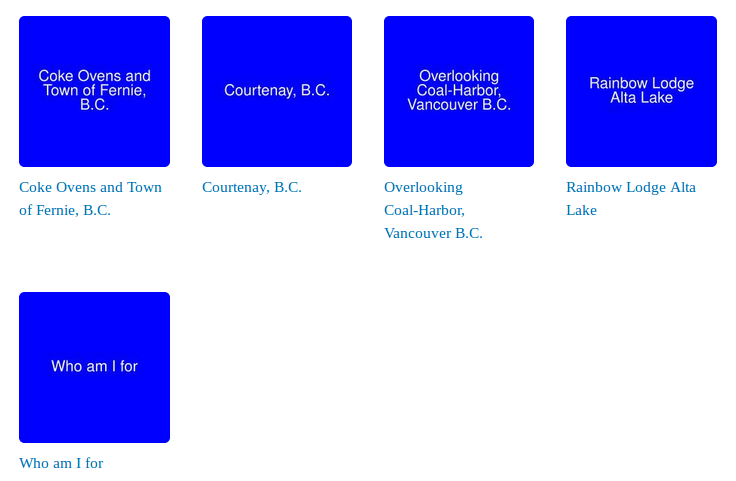
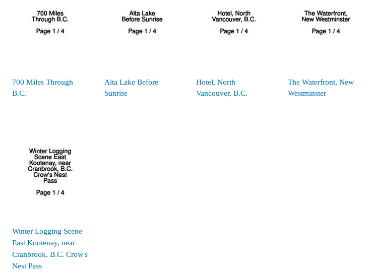

# Islandora Sample Content Generator

## Introduction

This module uses ImageMagick's `convert` command to generate sample images containing brief text, which are then ingested along with an accompanying MODS datastream using Islandora Batch's drush interface. It can generate and ingest objects with the following content models:

* Basic image (islandora:sp_basic_image)
* Large image (islandora:sp_large_image_cmodel)
* PDF (islandora:sp_pdf)
* Book, including pages (islandora:bookCModel)
* Newspaper, and newspaper issues, including pages (islandora:newspaperCModel and islandora:newspaperPageCModel)
* Collection (islandora:collectionCModel)

The images are very simple (some would say downright boring), just a colored background with the title of the object in white text (but you can choose the color):



Textual content (PDFs, books, and newspaper issues) has a white background with black text:



The images aren't meant to look good, they're intended to act as *lorem ipsum* content so you can test your site's configuration and behavior, or quickly populate an Islandora instance for training.

As an added bonus, since all sample content is loaded using Islandora's standard batch tools, all the standard derivatives are created.

## Requirements

* [Islandora Batch](https://github.com/Islandora/islandora_batch)
* To ingest books, you will need [Islandora Book Batch](https://github.com/Islandora/islandora_book_batch)
* To ingest newspaper issues, you will need [Islandora Newspaper Batch](https://github.com/mjordan/islandora_newspaper_batch)
* To purge objects using the 'iscgd' command, you will need [Islandora Solr Search](https://github.com/Islandora/islandora_solr_search)

If you don't have Book Batch or Newspaper Batch installed and try to generate sample book or newspaper content, or don't have Islandora Solr Search enabled and try to purge objects, drush will tell you that you need to enable the relevant module and exit.

ImageMagick must be installed, which is the case on most, if not all, Islandora servers.

## Usage

The Islandora Sample Content Generator provides two drush commands, one to generate and load objects, and one to purge those objects. There is no graphical user interface.

### Loading sample objects

To load sample objects, issue a command using the following template:

`drush iscgl --user=someuser --content_model=foo:contentModel --parent=bar:collection`

Some sample commands are:

* `drush iscgl --user=admin --quantity=20 --content_model=islandora:sp_basic_image --parent=islandora:sp_basic_image_collection --namespace=testing`
* `drush iscgl --user=admin  --content_model=islandora:sp_pdf --parent=islandora:sp_pdf_collection --pages=10 --metadata_file=/tmp/metadata.tsv`
* `drush iscgl --user=admin  --content_model=islandora:sp_pdf --parent=islandora:sp_pdf_collection  --load_content=false`

There is no need to run Islandora Batch's drush commands separately - the Sample Content Generator does that for you. Also, the generated content that is ingested is automatically deleted from the filesystem, unless you set the `--load_content` option to false.

Required parameters are:
* `--content_model` (the PID of the content model of the objects you want to create, taken from the list at the top of thie README)
* `--parent` (the PID of the parent, usually a collection, where you want to load the objects)

Optional parameters are:
* `--quantity` (how many sample objects to create; defaults to 5)
* `--namespace` (the namespace to use for the sample objects; defaults to "islandora")
* `--pages` (how many pages to add to PDFs, books, and newspaper issues; defaults to 4)
* `--bgcolor` (name of the background color for basic and large image content, from ImageMagick's [list of color names](http://www.imagemagick.org/script/color.php); defaults to "blue")
* `--metadata_file` (the absolute path to the TSV file containing metadata, described below; defaults to `includes/sample_metadata.tsv`).
* `--quantity_newspaper_issues` (number of issues to add to each newspaper; defaults to 0)
* `--timer` (true to activate; defaults to false; see details below)
* `--data_dir` (absolute path to the directory where you want the sample data to be written; defaults to 'islandora_scg' within your Drupal instance's temp directory, e.g., `/tmp/islandora_scg`)
* `--load_content` (false to generate content only and not load it; defaults to true; see details below)

### Purging sample objects

To purge objects created with this module, issue a command with the following template:

`drush iscgd --user=someuser --content_model=foo:contentModel --parent=bar:collection`

If you don't want to purge all sample objects, you need to include at least one of `--content_model` or `--parent` parameters, although you may include both. If you want to purge *all* sample objects, omit both `--content model` and `--parent` and include the `--quantity=all` parameter. "all" is the only allowed value of `--quantity`.

Some sample commands are:

* `drush iscgd --user=admin --parent=islandora:sp_pdf_collection`
* `drush iscgd --user=admin --content_model=islandora:sp_pdf`
* `drush iscgd --user=admin --quantity=all`

**The `iscgd` comand does not prompt you to confirm your choices, so choose them wisely.** Also remember that you can always delete sample objects using the regular tools Islandora provides - you don't need to use `iscgd`.

`drush iscgd` won't purge objects that were not generated by this module. When it queries Solr, it restricts its results to objects whose MODS contains `<recordOrigin>Islandora Sample Content Generator.</recordOrigin>`.

### Using the graphical user interface

This module provides a simple GUI for loading small numbers of objects. The GUI also does not support all content models or all options described above. It is available at `admin/islandora/tools/islandora_scg` and is available to users who have the "Generate sample Islandora content" permission.

## Generating and loading newspapers

Islandora Sample Content Generator provides several options for creating newspaper content.

* You can generate and load newspapers, e.g., `drush iscgl --user=admin --quantity=2 --content_model=islandora:newspaperCModel --parent=islandora:newspaper_collection --namespace=islandora` will generate and load 2 newspapers in the collection with PID "islandora:newspaper_collection"
* You can generate and load issues into an existing newspaper, e.g., `drush iscgl --user=admin --quantity=2 --content_model=islandora:newspaperPageCModel --parent=testing:62 --namespace=testing` will generate and load two issues into the existing newspaper with PID "testing:62"
* You can generate and load newspapers and populate each one with issues at the same time, e.g., `drush iscgl --user=admin --quantity=2 --content_model=islandora:newspaperCModel --parent=islandora:newspaper_collection --namespace=islandora --quantity_newspaper_issues=4` will generate and load 2 newspapers into the collection with PID "islandora_newspaper_collection" and also generate and load 4 issues into each

Be careful with the last option, since high values in the `--quantity` and `--quantity_newspaper_issues` parameters can add up to a lot of batch generating and loading.

## Sample metadata

The metadata used for the sample objects is taken, at random, from `includes/sample_metadata.tsv` ([view it here](https://github.com/mjordan/islandora_scg/blob/7.x/includes/sample_metadata.tsv)). This metadata is derived from [a collection of early-20th century postcards](http://digital.lib.sfu.ca/bcp-collection) depicting various landscapes and landmarks in British Columbia. Each tab-delimited record contains a title, a date of publication, one or more place names, one or more subject keywords, and a description.

If you want to use other metadata for your sample objects, you can replace this file with our own, as long as you follow the povided file's structure: five tab-separated columns: title, date, place name(s), subject keyword(s), and description. All columns are required but can be empty. Repeated place names and subject keywords are separated by semicolons. You can pass in the absolute path to your metadata file using the `--metadata_file` parameter. If you are using your own metadata file, lines from it will be picked at random, just like with the default metadata file.

You can gain additional control of the metadata for your sample objects by using Drupal's theming layer to completely override the way that the MODS datastream is populated. To do so, override the islandora_scg_preprocess_islandora_scg_metadata_ds() function and the islandora_scg_metadata_ds.tpl.php template file. If you customize the MODS generated by this module, it is important that your MODS records contain the following element:

```xml
<recordInfo>
  <recordOrigin>Islandora Sample Content Generator.</recordOrigin>
</recordInfo>
```

This is important since it is used in the query generated by the `iscgd` command.

## The timer

Adding the `--timer=true` option will activate a timer that reports at the end of the ingest job. For example, when loading some images, the timer will report something like:

```Took 28.994158029556 seconds to ingest 5 basic images  (for an average of 5.7988316059113 seconds each)```

The results include only the time taken to ingest objects, not to generate them. Also, for paged content, the average time reported is not for each page, but for each book or newspaper (or newspaper issue, if you are loading issues into an existing newspaper).

## Generating but not loading content

Adding the `--load_content=false` option will generate sample data and not load it. This option is intended to allow you to inspect the sample data or modify it in some way before loading it with the appropriate batch module. If this option is set to false, the data will not be deleted from the filesystem for you, it will remain in the location defined by `--data_dir`.

Note that when generating newspaper content, the `--load_content=false` option only works as expected when generating newspaper objects, or when generating issue content. It doesn't work as expected when generating both newspaper objects and issues in the same command (i.e., the third example supplied in the "Generating and loading newspapers" section above).

## Using the graphical user interface

Islandora Sample Content Generator is intended to be used via its Drush interface. But, if you only need to generate a few objects quickly, you can use the the graphical user interface. The GUI is available at `admin/islandora/tools/islandora_scg` and is linked under the "Islandora Utility Modules" group in the Islandora admin menu.

This GUI should only be used for generating small numbers of objects, probably 10 or fewer. You will see a warning to that effect:


Also, the GUI only allows you to generate content of a few types, specifically, collection, basic image, large image, PDF, and book.

After you have selected your options and click the "Generate sample objects" button, you will see a little spinner to the right of the button while the content is being generated:


When the spinner disappears, your sample content will be available in the specified collection.


## Maintainer

* [Mark Jordan](https://github.com/mjordan)

## Development and feedback

Pull requests are welcome, as are use cases and suggestions.

## License

* [GPLv3](http://www.gnu.org/licenses/gpl-3.0.txt)
* The sample metadata in includes/sample_metadata.tsv is distriubuted under the [Creative Commons Attribution-NonCommercial 3.0 Unported](http://creativecommons.org/licenses/by-nc/3.0/legalcode) license.
